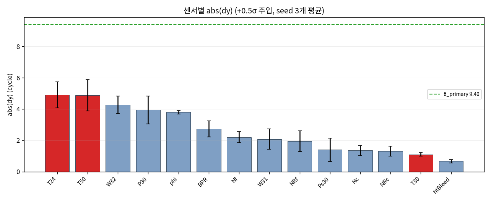

# 모델 입력 센서 감도 프로파일

- hold-out 3237 window 전체에 센서 하나씩 **+0.5σ (정규화 공간)** 를 더하고 |Δŷ| 를 측정
- seed [529, 530, 531] 세 모델 각각에 대해 수행
- Phase C 의 bias 주입은 정규화 공간에서 정확히 α 이므로, 여기 값이 "bias α=0.5 주입 시 예측이 평균 몇 cycle 움직이는가" 와 같다
- 비교 기준: θ_primary = 9.399 (이 값을 넘겨야 저하 라벨이 생긴다)

## 1. 센서별 absΔŷ (seed 평균 내림차순)

| feat | 센서 | col | s529 | s530 | s531 | 평균 | 표준편차 | 부호평균 | 주입대상 |
|---|---|---|---|---|---|---|---|---|---|
| 3 | T24 | s2 | 4.121 | 4.818 | 5.788 | 4.909 | 0.837 | -4.874 | ● |
| 5 | T50 | s4 | 6.044 | 4.205 | 4.390 | 4.880 | 1.012 | -4.591 | ● |
| 16 | W32 | s21 | 4.864 | 4.161 | 3.756 | 4.260 | 0.560 | -3.980 |  |
| 6 | P30 | s7 | 4.821 | 3.979 | 3.035 | 3.945 | 0.893 | 3.580 |  |
| 10 | phi | s12 | 3.832 | 3.885 | 3.680 | 3.799 | 0.106 | -3.321 |  |
| 13 | BPR | s15 | 2.745 | 3.249 | 2.224 | 2.739 | 0.513 | -2.701 |  |
| 2 | op3 | op3 | 4.074 | 1.692 | 1.348 | 2.371 | 1.484 | 1.296 |  |
| 1 | op2 | op2 | 2.581 | 2.130 | 2.272 | 2.328 | 0.230 | 1.533 |  |
| 7 | Nf | s8 | 2.606 | 2.081 | 1.919 | 2.202 | 0.359 | 1.634 |  |
| 15 | W31 | s20 | 1.579 | 1.842 | 2.814 | 2.078 | 0.651 | -1.927 |  |
| 11 | NRf | s13 | 2.721 | 1.533 | 1.593 | 1.949 | 0.670 | -1.927 |  |
| 0 | op1 | op1 | 2.077 | 1.461 | 1.566 | 1.701 | 0.329 | -1.577 |  |
| 9 | Ps30 | s11 | 0.876 | 1.088 | 2.259 | 1.407 | 0.745 | -1.072 |  |
| 8 | Nc | s9 | 1.199 | 1.729 | 1.167 | 1.365 | 0.315 | 0.716 |  |
| 12 | NRc | s14 | 0.987 | 1.617 | 1.342 | 1.316 | 0.316 | -0.717 |  |
| 4 | T30 | s3 | 1.126 | 0.985 | 1.188 | 1.100 | 0.104 | 0.004 | ● |
| 14 | htBleed | s17 | 0.705 | 0.538 | 0.756 | 0.667 | 0.114 | 0.050 |  |

## 2. Phase C 주입 대상 3 센서

| 센서 | absΔŷ 평균 | 표준편차 | 최대 센서 대비 | 전체 순위 | θ_primary 대비 |
|---|---|---|---|---|---|
| T24 | 4.909 | 0.837 | 1.000 | 1 | 0.522 |
| T50 | 4.880 | 1.012 | 0.994 | 2 | 0.519 |
| T30 | 1.100 | 0.104 | 0.224 | 16 | 0.117 |

**T30 의 감도는 T24 의 0.22 배**이고, seed 간 표준편차는 0.104 에 불과하다 (seed [529, 530, 531] 전부에서 같은 결론). 즉 T30 가 저하 라벨을 만들지 못하는 것은 특정 학습 seed 의 우연이 아니라 세 모델이 공통으로 학습한 성질이다.

## 3. 그림

