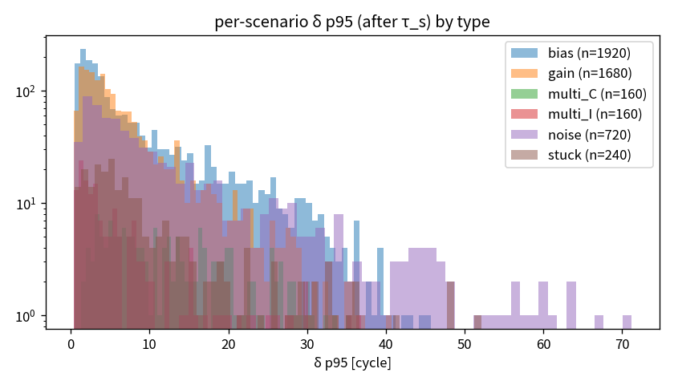

# Phase D-2 — δ 분포와 θ 결정 근거

- 기준 seed 529, seeds [529, 530, 531], k=5, m=7, θ_low = 0.5·θ_high
- **권고 θ_primary = 9.399** (θ_primary = max(V1 p95, V2 p95))
- θ_alt2 (test RMSE) = 13.33

## clean 자연 변동성
| metric | p50 | p75 | p90 | p95 | p99 | p99.9 | n | mean | max |
|---|---|---|---|---|---|---|---|---|---|
| V1 abs(ŷ(t)−ŷ(t−1)) | 1.901 | 4.02 | 7.178 | 9.399 | 14.43 | 20.9 | 3217 | 2.979 | 24.2 |
| V2 seed std | 1.714 | 2.98 | 4.438 | 5.437 | 7.568 | 10.03 | 3237 | 2.148 | 12.17 |

### θ 후보와 clean-only 대조 진입율 (결정 규칙 1: cycle 양성률 ≤ 5%)
| cand | theta | V1 | V2 | ctrl unit_entry | ctrl cycle_pos |
|---|---|---|---|---|---|
| p90 | 7.178 | 7.178 | 4.438 | 0.6 | 0.104 |
| p95 | 9.399 | 9.399 | 5.437 | 0.3 | 0.03522 |
| p99 | 14.43 | 14.43 | 7.568 | 0 | 0 |

## τ_s 이후 δ 요약 — 유형 × 강도
| type | param | n | delta_mean | delta_p95(mean) | delta_max(mean) | frac>7.18 | frac>9.4 | frac>13.3 | frac>14.4 |
|---|---|---|---|---|---|---|---|---|---|
| bias | 0.3 | 480 | 1.65 | 4.04 | 5.21 | 0.037 | 0.0164 | 0.00328 | 0.00175 |
| bias | 0.5 | 480 | 2.76 | 6.63 | 8.33 | 0.105 | 0.0655 | 0.0287 | 0.0219 |
| bias | 0.75 | 480 | 4.14 | 9.82 | 12 | 0.17 | 0.126 | 0.0755 | 0.0646 |
| bias | 1 | 480 | 5.5 | 12.8 | 15.4 | 0.226 | 0.173 | 0.117 | 0.107 |
| gain | 0.25 | 240 | 0.952 | 2.07 | 2.8 | 0.002 | 0.000755 | 0 | 0 |
| gain | 0.5 | 480 | 1.87 | 4.06 | 5.29 | 0.0242 | 0.00812 | 0.0027 | 0.0022 |
| gain | 0.75 | 240 | 2.94 | 6.29 | 8.06 | 0.0858 | 0.0395 | 0.0121 | 0.00937 |
| gain | 1 | 240 | 3.43 | 7.45 | 9.37 | 0.128 | 0.0676 | 0.025 | 0.0185 |
| gain | 1.5 | 240 | 4.9 | 10.5 | 13 | 0.229 | 0.153 | 0.0729 | 0.0578 |
| gain | 2 | 240 | 6.23 | 13.3 | 16.3 | 0.3 | 0.217 | 0.129 | 0.112 |
| multi_C | 0.3 | 80 | 4.58 | 10.4 | 12.6 | 0.203 | 0.138 | 0.0625 | 0.0475 |
| multi_C | 0.5 | 80 | 7.37 | 16.1 | 18.8 | 0.358 | 0.263 | 0.169 | 0.151 |
| multi_I | 0.3 | 80 | 2.07 | 5.45 | 6.95 | 0.0727 | 0.0489 | 0.027 | 0.0229 |
| multi_I | 0.5 | 80 | 3.11 | 7.72 | 9.67 | 0.0985 | 0.0667 | 0.0427 | 0.0389 |
| noise | 1 | 240 | 1.87 | 5.24 | 7.91 | 0.0462 | 0.024 | 0.00862 | 0.0067 |
| noise | 2 | 240 | 4.48 | 12.3 | 16.4 | 0.188 | 0.138 | 0.083 | 0.0714 |
| noise | 3 | 240 | 7.66 | 19.3 | 24.9 | 0.326 | 0.258 | 0.18 | 0.163 |
| stuck | nan | 240 | 4.23 | 9.36 | 11.6 | 0.161 | 0.109 | 0.0649 | 0.058 |

## 유형 × 센서
| type | sensor | n | delta_mean | delta_p95(mean) | delta_max(mean) | frac>7.18 | frac>9.4 | frac>13.3 | frac>14.4 |
|---|---|---|---|---|---|---|---|---|---|
| bias | T24 | 640 | 5.07 | 10.7 | 12.9 | 0.221 | 0.149 | 0.0804 | 0.0674 |
| bias | T30 | 640 | 1.19 | 2.38 | 3.17 | 0.00092 | 4.71e-05 | 0 | 0 |
| bias | T50 | 640 | 4.29 | 11.9 | 14.6 | 0.181 | 0.137 | 0.0882 | 0.0792 |
| gain | T24 | 560 | 4.68 | 9.04 | 11.1 | 0.204 | 0.129 | 0.0625 | 0.0511 |
| gain | T30 | 560 | 1.37 | 2.98 | 3.96 | 0.00455 | 0.000542 | 2.52e-05 | 1e-05 |
| gain | T50 | 560 | 3.47 | 8.45 | 10.7 | 0.132 | 0.0825 | 0.0422 | 0.0353 |
| multi_C | T24+T30+T50 | 160 | 5.98 | 13.2 | 15.7 | 0.281 | 0.201 | 0.116 | 0.0993 |
| multi_I | T24+T30+T50 | 160 | 2.59 | 6.58 | 8.31 | 0.0856 | 0.0578 | 0.0349 | 0.0309 |
| noise | T24 | 240 | 6.28 | 16.2 | 21 | 0.275 | 0.206 | 0.131 | 0.116 |
| noise | T30 | 240 | 1.63 | 4.52 | 6.92 | 0.0309 | 0.015 | 0.00548 | 0.00389 |
| noise | T50 | 240 | 6.09 | 16.1 | 21.2 | 0.255 | 0.199 | 0.135 | 0.121 |
| stuck | T24 | 80 | 6.51 | 12.8 | 15.2 | 0.303 | 0.211 | 0.125 | 0.11 |
| stuck | T30 | 80 | 1.82 | 4.09 | 5.22 | 0.0106 | 0.00252 | 0.000421 | 0 |
| stuck | T50 | 80 | 4.35 | 11.1 | 14.3 | 0.168 | 0.113 | 0.0696 | 0.0639 |

## 유형 × 시점
| type | timing_p | n | delta_mean | delta_p95(mean) | delta_max(mean) | frac>7.18 | frac>9.4 | frac>13.3 | frac>14.4 |
|---|---|---|---|---|---|---|---|---|---|
| bias | 0.2 | 480 | 5.2 | 13.2 | 16.4 | 0.24 | 0.184 | 0.118 | 0.104 |
| bias | 0.4 | 480 | 4.49 | 11 | 13.7 | 0.198 | 0.146 | 0.0861 | 0.0747 |
| bias | 0.6 | 480 | 2.91 | 6.47 | 7.8 | 0.0919 | 0.0501 | 0.021 | 0.0166 |
| bias | 0.8 | 480 | 1.46 | 2.63 | 2.95 | 0.00674 | 0.000919 | 0 | 0 |
| gain | 0.2 | 420 | 3.84 | 9.18 | 12.2 | 0.162 | 0.109 | 0.0589 | 0.05 |
| gain | 0.4 | 420 | 3.66 | 8.08 | 10.3 | 0.144 | 0.095 | 0.0495 | 0.0419 |
| gain | 0.6 | 420 | 2.87 | 5.62 | 6.83 | 0.0948 | 0.0527 | 0.0219 | 0.0166 |
| gain | 0.8 | 420 | 2.31 | 4.42 | 5.02 | 0.0532 | 0.0254 | 0.00927 | 0.00669 |
| multi_C | 0.2 | 40 | 9.12 | 21.8 | 26 | 0.481 | 0.396 | 0.258 | 0.23 |
| multi_C | 0.4 | 40 | 7.35 | 16.7 | 20.5 | 0.404 | 0.302 | 0.169 | 0.139 |
| multi_C | 0.6 | 40 | 4.91 | 10 | 11.5 | 0.219 | 0.105 | 0.0352 | 0.0288 |
| multi_C | 0.8 | 40 | 2.53 | 4.38 | 4.83 | 0.0176 | 0.000472 | 0 | 0 |
| multi_I | 0.2 | 40 | 4.33 | 11.7 | 15 | 0.175 | 0.13 | 0.0914 | 0.0841 |
| multi_I | 0.4 | 40 | 2.96 | 7.95 | 10.2 | 0.114 | 0.0782 | 0.039 | 0.0318 |
| multi_I | 0.6 | 40 | 1.93 | 4.49 | 5.65 | 0.0533 | 0.0226 | 0.00912 | 0.00778 |
| multi_I | 0.8 | 40 | 1.13 | 2.19 | 2.48 | 0 | 0 | 0 | 0 |
| noise | 0.2 | 180 | 6.95 | 19 | 26.1 | 0.281 | 0.222 | 0.16 | 0.147 |
| noise | 0.4 | 180 | 5.87 | 15.6 | 20.8 | 0.253 | 0.196 | 0.13 | 0.115 |
| noise | 0.6 | 180 | 3.85 | 9.6 | 12.3 | 0.159 | 0.113 | 0.0632 | 0.0527 |
| noise | 0.8 | 180 | 2.01 | 5.01 | 6.37 | 0.0544 | 0.0287 | 0.00923 | 0.00663 |
| stuck | 0.2 | 60 | 6.88 | 16.3 | 20.5 | 0.282 | 0.22 | 0.158 | 0.145 |
| stuck | 0.4 | 60 | 5.13 | 11.2 | 14.1 | 0.218 | 0.143 | 0.0831 | 0.0727 |
| stuck | 0.6 | 60 | 3.32 | 6.67 | 7.92 | 0.117 | 0.0609 | 0.0173 | 0.0141 |
| stuck | 0.8 | 60 | 1.57 | 3.26 | 3.9 | 0.0263 | 0.0117 | 0.000709 | 0.000355 |

## 시점 × 포화 여부 (T_u − τ_s > 125)
| timing_p | saturated | n | delta_mean | delta_p95(mean) | delta_max(mean) | frac>7.18 | frac>9.4 | frac>13.3 | frac>14.4 |
|---|---|---|---|---|---|---|---|---|---|
| 0.2 | False | 732 | 5.01 | 12.7 | 16 | 0.221 | 0.164 | 0.103 | 0.0904 |
| 0.2 | True | 488 | 5.42 | 13.7 | 18.1 | 0.236 | 0.181 | 0.119 | 0.107 |
| 0.4 | False | 1037 | 4.24 | 10.1 | 12.8 | 0.18 | 0.127 | 0.0709 | 0.0606 |
| 0.4 | True | 183 | 5.86 | 14.5 | 18.7 | 0.264 | 0.206 | 0.138 | 0.123 |
| 0.6 | False | 1220 | 3.09 | 6.7 | 8.19 | 0.107 | 0.0617 | 0.0274 | 0.0219 |
| 0.8 | False | 1220 | 1.87 | 3.67 | 4.26 | 0.0309 | 0.0139 | 0.00459 | 0.0033 |

## 결정 규칙 2 확인: 최저 강도 bias 에서 δ > θ_primary 비율
- bias α=0.3: τ_s 이후 δ > θ_primary 인 cycle 비율 평균 = 0.016 (거의 0 이면 α 하한 인하 또는 θ 하향 검토)

## 그림

## 다음 단계
1. `configs/label.yaml` 의 `thetas.theta_primary.value` 에 확정값 기록 (null 이면 위 권고값 자동 사용)
2. `decision` 란에 날짜·근거 기록 후 `scripts/08_build_labels.py` 실행
