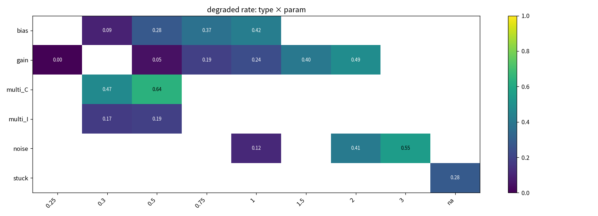
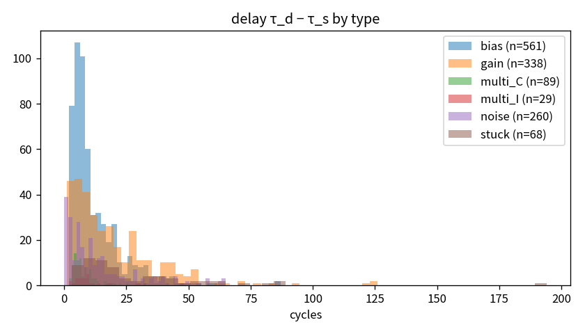

# Phase D-5 — 라벨 요약

- 기준 θ: theta_primary = 9.399, k=5, m=7, θ_low ratio=0.5
- (unit, scenario) 수: 4880, 저하 비율: 0.276

## 1. 유형 × 강도별 저하 (unit, scenario) 비율
| type | 0.25 | 0.3 | 0.5 | 0.75 | 1 | 1.5 | 2 | 3 | na |
|---|---|---|---|---|---|---|---|---|---|
| bias |  | 0.09 | 0.28 | 0.37 | 0.42 |  |  |  |  |
| gain | 0.00 |  | 0.05 | 0.19 | 0.24 | 0.40 | 0.49 |  |  |
| multi_C |  | 0.47 | 0.64 |  |  |  |  |  |  |
| multi_I |  | 0.17 | 0.19 |  |  |  |  |  |  |
| noise |  |  |  |  | 0.12 |  | 0.41 | 0.55 |  |
| stuck |  |  |  |  |  |  |  |  | 0.28 |

## 2. 유형별 지연 τ_d − τ_s (저하 케이스만)
| type | n | min | p25 | median | p75 | max |
|---|---|---|---|---|---|---|
| bias | 561 | 2.0 | 6.0 | 8.0 | 15.0 | 87.0 |
| gain | 338 | 1.0 | 7.0 | 14.0 | 26.8 | 126.0 |
| multi_C | 89 | 2.0 | 4.0 | 6.0 | 10.0 | 42.0 |
| multi_I | 29 | 2.0 | 6.0 | 8.0 | 12.0 | 48.0 |
| noise | 260 | 0.0 | 3.0 | 9.0 | 18.2 | 65.0 |
| stuck | 68 | 3.0 | 9.8 | 18.0 | 39.0 | 194.0 |

### 2-1. 긴 지연 (delay > 50 cycle)
- 해당 (unit, scenario): 44 / 1345 저하 케이스 = 0.033
| type | 저하 n | 긴 지연 n | 비율 | delay median | delay max |
|---|---|---|---|---|---|
| bias | 561 | 5 | 0.009 | 61.000 | 87.000 |
| gain | 338 | 17 | 0.050 | 66.000 | 126.000 |
| multi_C | 89 | 0 | 0.000 | None | None |
| multi_I | 29 | 0 | 0.000 | None | None |
| noise | 260 | 11 | 0.042 | 58.000 | 65.000 |
| stuck | 68 | 11 | 0.162 | 65.000 | 194.000 |

**유형 × 강도별 긴 지연 비율**
| type | 0.25 | 0.3 | 0.5 | 0.75 | 1 | 1.5 | 2 | 3 | na |
|---|---|---|---|---|---|---|---|---|---|
| bias |  | 0.04 | 0.01 | 0.01 | 0.00 |  |  |  |  |
| gain | 0.00 |  | 0.18 | 0.13 | 0.02 | 0.04 | 0.02 |  |  |
| multi_C |  | 0.00 | 0.00 |  |  |  |  |  |  |
| multi_I |  | 0.00 | 0.00 |  |  |  |  |  |  |
| noise |  |  |  |  | 0.14 |  | 0.03 | 0.03 |  |
| stuck |  |  |  |  |  |  |  |  | 0.16 |

## 3. 시점별 저하율 — 포화(T_u − τ_s > 125) 여부 분리
| timing_p | sat=False rate | sat=False n | sat=True rate | sat=True n |
|---|---|---|---|---|
| 0.20 | 0.47 | 732 | 0.52 | 488 |
| 0.40 | 0.38 | 1037 | 0.51 | 183 |
| 0.60 | 0.19 | 1220 |  | 0 |
| 0.80 | 0.03 | 1220 |  | 0 |

## 4. 복귀(1→0) 발생 비율과 위치
- 복귀가 한 번 이상 발생한 (unit, scenario): 1302 / 4880 = 0.267
- 복귀 시점 / T_u: median 0.82, 수명 말기(>0.9) 비율 0.24, n=1399

## 5. θ 세 후보 간 cycle 라벨 일치율
| a | b | agreement | kappa | jaccard_pos | pos_rate_a | pos_rate_b |
|---|---|---|---|---|---|---|
| theta_alt1 | theta_alt2 | 0.973 | 0.748 | 0.617 | 0.057 | 0.059 |
| theta_alt1 | theta_primary | 0.963 | 0.737 | 0.608 | 0.057 | 0.094 |
| theta_alt2 | theta_primary | 0.965 | 0.750 | 0.624 | 0.059 | 0.094 |

- `agreement` 는 전 cycle raw 일치율, `kappa` 는 우연 일치를 보정한 Cohen's κ, `jaccard_pos` 는 양성 cycle 집합의 Jaccard 이다.
- 양성률이 낮으면 raw 일치율은 높게 나오므로 κ·Jaccard 를 함께 본다 (`pos_rate_a/b` 는 각 θ 의 양성 cycle 비율).
(일치율은 600 개 (unit, scenario) 표본 기준)

| theta_name | degraded_rate | delay_median |
|---|---|---|
| theta_alt1 | 0.193 | 15.000 |
| theta_alt2 | 0.191 | 12.000 |
| theta_primary | 0.276 | 9.000 |

## 6. clean-only 대조의 저하 진입율 (θ 검증)
| cand | theta | unit_entry_rate | cycle_positive_rate |
|---|---|---|---|
| p90 | 7.178 | 0.6 | 0.104 |
| p95 | 9.399 | 0.3 | 0.03522 |
| p99 | 14.43 | 0 | 0 |

## 부록. (k, m) 민감도 (θ_primary 고정)
| k | m | degraded_rate | delay_median | reversion_rate |
|---|---|---|---|---|
| 3 | 5 | 0.309 | 9.000 | 0.304 |
| 3 | 7 | 0.317 | 9.000 | 0.312 |
| 3 | 10 | 0.322 | 9.000 | 0.318 |
| 5 | 5 | 0.254 | 11.000 | 0.240 |
| 5 | 7 | 0.276 | 9.000 | 0.267 |
| 5 | 10 | 0.286 | 9.000 | 0.278 |
| 7 | 7 | 0.228 | 11.000 | 0.203 |
| 7 | 10 | 0.259 | 9.000 | 0.244 |

