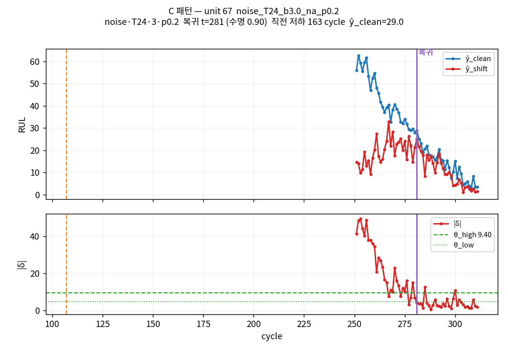
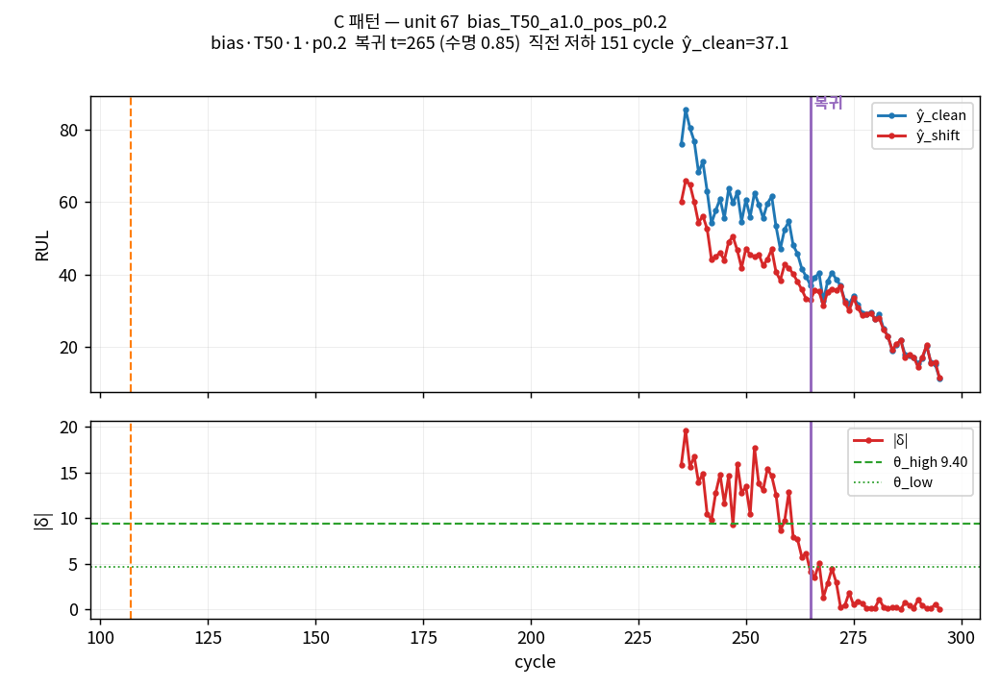
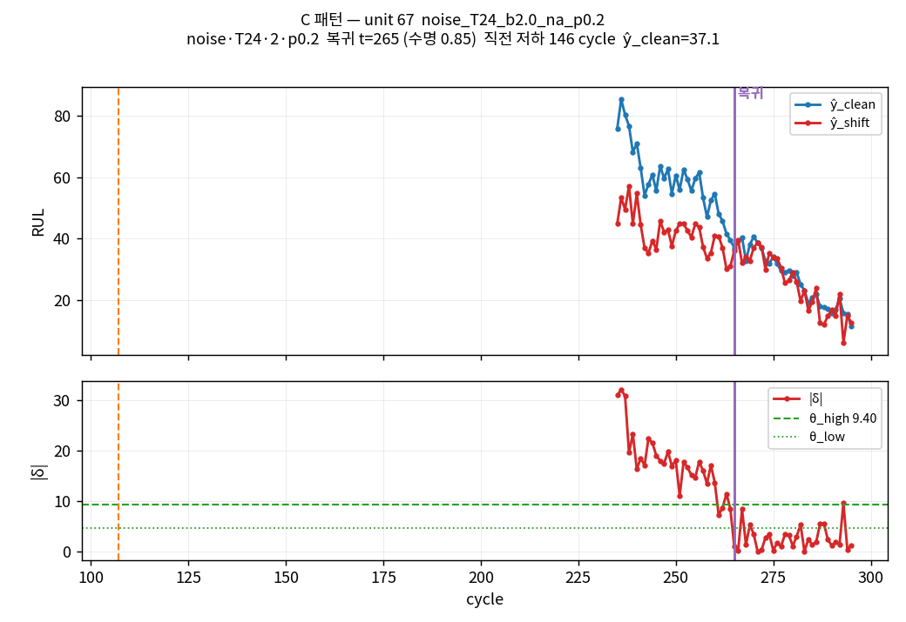
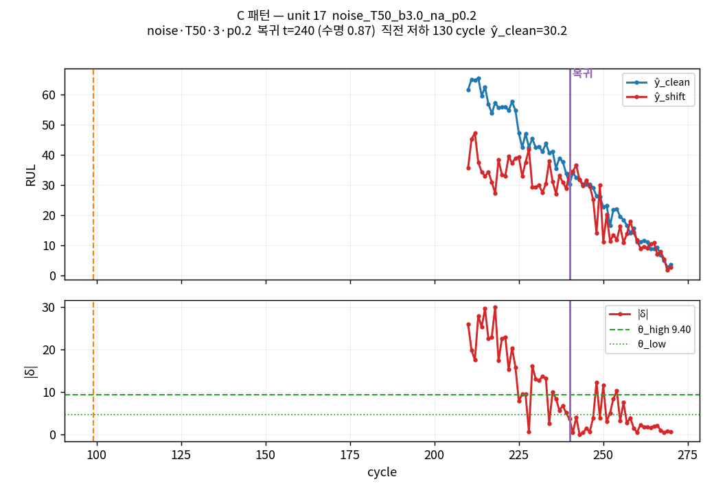
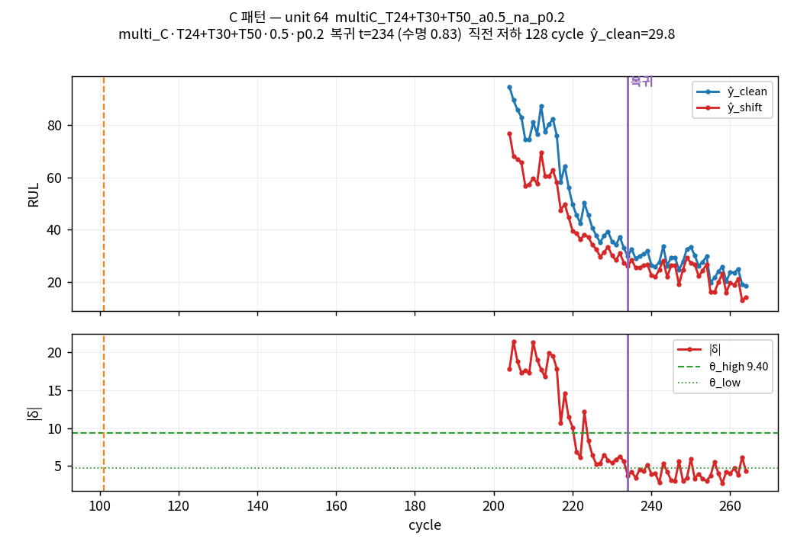
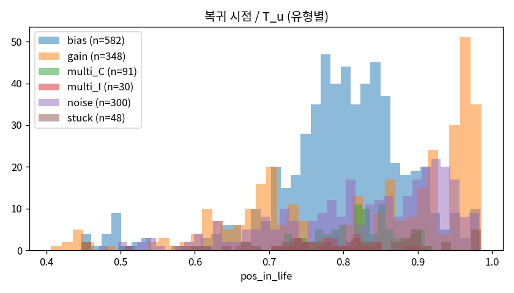
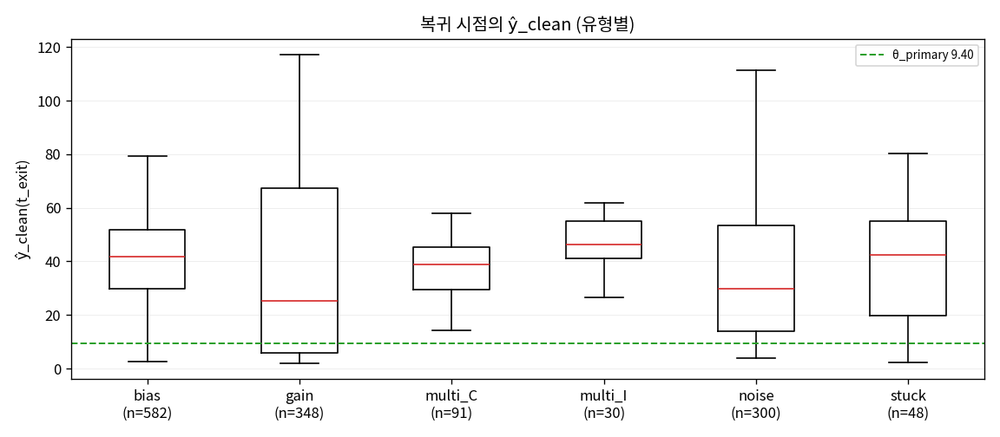

# Phase D 마감 — 복귀(1→0) 진단

## 1. 요약

- 기준 라벨: θ_primary = 9.399, k=5, m=7, θ_low_ratio=0.5
- 전체 (unit, scenario): 4880
- 저하 판정 시나리오: 1345 (0.276)
- 복귀 1회 이상 시나리오: 1302 / 4880 = 0.267  (저하 시나리오 대비 0.968)
- 총 복귀 이벤트: 1399
- 재진입(20 cycle 내) 이벤트: 42 (0.030)

## 2. 유형별

| type | 저하 n | 복귀율 | 이벤트 n | 재진입률 | 직전저하 median | ŷ_clean median | 말기(>0.9) 비율 |
|---|---|---|---|---|---|---|---|
| bias | 561 | 0.998 | 582 | 0.012 | 43.000 | 41.776 | 0.103 |
| gain | 338 | 0.947 | 348 | 0.017 | 37.500 | 25.155 | 0.457 |
| multi_C | 89 | 1.000 | 91 | 0.011 | 50.000 | 38.892 | 0.066 |
| multi_I | 29 | 1.000 | 30 | 0.033 | 43.500 | 46.334 | 0.033 |
| noise | 260 | 0.988 | 300 | 0.090 | 32.000 | 29.837 | 0.333 |
| stuck | 68 | 0.691 | 48 | 0.000 | 41.000 | 42.479 | 0.229 |

## 3. 유형 × 강도별 복귀율 / 재진입률

**복귀율**
| type | 0.25 | 0.3 | 0.5 | 0.75 | 1 | 1.5 | 2 | 3 | na |
|---|---|---|---|---|---|---|---|---|---|
| bias |  | 1.00 | 1.00 | 1.00 | 1.00 |  |  |  |  |
| gain | 1.00 |  | 1.00 | 0.87 | 1.00 | 0.94 | 0.95 |  |  |
| multi_C |  | 1.00 | 1.00 |  |  |  |  |  |  |
| multi_I |  | 1.00 | 1.00 |  |  |  |  |  |  |
| noise |  |  |  |  | 1.00 |  | 0.99 | 0.98 |  |
| stuck |  |  |  |  |  |  |  |  | 0.69 |

**재진입률**
| type | 0.25 | 0.3 | 0.5 | 0.75 | 1 | 1.5 | 2 | 3 | na |
|---|---|---|---|---|---|---|---|---|---|
| bias |  | 0.02 | 0.01 | 0.02 | 0.01 |  |  |  |  |
| gain | 0.00 |  | 0.00 | 0.00 | 0.00 | 0.01 | 0.04 |  |  |
| multi_C |  | 0.00 | 0.02 |  |  |  |  |  |  |
| multi_I |  | 0.00 | 0.06 |  |  |  |  |  |  |
| noise |  |  |  |  | 0.14 |  | 0.11 | 0.06 |  |
| stuck |  |  |  |  |  |  |  |  | 0.00 |

## 4. 복귀 시점 ŷ_clean 분포

| 구간 | n | p10 | p50 | p90 | ŷ<θ(9.40) 비율 |
|---|---|---|---|---|---|
| 전체 | 1399 | 6.991 | 38.892 | 74.542 | 0.129 |
| 말기 (pos>0.9) | 337 | 4.248 | 8.580 | 17.873 | 0.534 |
| 중반 (pos≤0.9) | 1062 | 26.140 | 44.828 | 77.615 | 0.000 |

## 5. 복귀 패턴 분류

- **A flicker**: 재진입 20 cycle 내 **또는** 직전 저하 구간 < 10 cycle
- **B 말기 수렴**: A 아니고 (ŷ_clean(t_exit) < θ_primary **또는** pos_in_life > 0.9)
- **C 진짜 중반 복귀**: A 도 B 도 아님

| pattern | n | 비율 |
|---|---|---|
| A | 77 | 0.055 |
| B | 335 | 0.239 |
| C | 987 | 0.706 |

**유형별 A/B/C 비율**
| type | n | A | B | C |
|---|---|---|---|---|
| bias | 582 | 0.024 | 0.103 | 0.873 |
| gain | 348 | 0.052 | 0.457 | 0.491 |
| multi_C | 91 | 0.011 | 0.066 | 0.923 |
| multi_I | 30 | 0.033 | 0.033 | 0.933 |
| noise | 300 | 0.137 | 0.327 | 0.537 |
| stuck | 48 | 0.042 | 0.229 | 0.729 |

### 5-1. 분류 규칙 점검

**(a) B 규칙의 `ŷ_clean < θ_primary` 조건은 단독으로 한 번도 발동하지 않는다.**

| 조건 | n |
|---|---|
| ŷ<θ 만 | 0 |
| pos>0.9 만 | 155 |
| 둘 다 | 180 |

비-A 이벤트 1322 개 중 `ŷ<θ` 만으로 B 가 되는 경우는 0 건이다. §4 에서 보듯 중반(pos≤0.9) 이벤트의 `ŷ<θ` 비율이 정확히 0 이므로, B 규칙은 실질적으로 `pos_in_life > 0.9` 단독 조건과 같다. 따라서 A/B/C 분해는 사실상 이 임계 하나가 좌우한다.

**(b) 그 임계를 바꾸면 B 와 C 가 크게 뒤집힌다.**

| pos 임계 | A | B | C | 판정 |
|---|---|---|---|---|
| 0.900 | 0.055 | 0.239 | 0.706 |  / C 존재 |
| 0.850 | 0.055 | 0.385 | 0.560 |  / C 존재 |
| 0.800 | 0.055 | 0.578 | 0.367 | B 우세 / C 존재 |
| 0.750 | 0.055 | 0.723 | 0.222 | B 우세 / C 존재 |
| 0.700 | 0.055 | 0.828 | 0.117 | B 우세 |
| 0.600 | 0.055 | 0.912 | 0.033 | B 우세 |

**(c) C 이벤트는 중반에 고르게 퍼져 있지 않고 임계 바로 아래에 몰려 있다.** C 의 pos_in_life 는 median 0.79, p25 0.73, p75 0.84 이고 83.4% 가 pos>0.7 이다. 또한 93.9% 가 재진입 없는 최종 복귀이며 직전 저하 구간 median 은 39 cycle 이다.

> 종합하면 C 로 분류된 이벤트의 상당수는 §7 사례에서 보듯 δ 가 RUL→0 과 함께 단조 감소해 소멸하는 **말기 수렴의 연장**이며, `pos>0.9` 라는 컷오프가 이 현상의 시작점보다 늦게 잡혀 있어 B 가 아닌 C 로 새어 들어온 것이다. 아래 §9 판정은 지시서 규칙을 그대로 적용한 결과이고, 이 한계를 함께 읽어야 한다.

## 6. (k, m) 대안 비교

기존 state parquet 을 건드리지 않고 delta 로부터 메모리에서 다시 라벨링해 비교한다.

| k | m | 기준 | 저하율 | 복귀율 | 이벤트 n | 재진입률 | A | B | C | 지연 median |
|---|---|---|---|---|---|---|---|---|---|---|
| 5 | 7 | ← | 0.276 | 0.267 | 1399 | 0.030 | 0.055 | 0.239 | 0.706 | 9.000 |
| 7 | 10 |  | 0.259 | 0.244 | 1255 | 0.021 | 0.025 | 0.217 | 0.758 | 9.000 |
| 7 | 7 |  | 0.228 | 0.203 | 1017 | 0.007 | 0.010 | 0.282 | 0.708 | 11.000 |
| 5 | 10 |  | 0.286 | 0.278 | 1515 | 0.059 | 0.084 | 0.214 | 0.702 | 9.000 |

## 7. C 패턴 사례

| # | type | param | timing_p | unit | t_exit | pos_in_life | 직전저하 | ŷ_clean | δ(t_exit) | 그림 |
|---|---|---|---|---|---|---|---|---|---|---|
| 1 | noise | 3 | 0.20 | 67 | 281 | 0.90 | 163 | 29.04 | 3.99 | figures/D_reversion_case_1.png |
| 2 | bias | 1 | 0.20 | 67 | 265 | 0.85 | 151 | 37.11 | 4.15 | figures/D_reversion_case_2.png |
| 3 | noise | 2 | 0.20 | 67 | 265 | 0.85 | 146 | 37.11 | 1.03 | figures/D_reversion_case_3.png |
| 4 | noise | 3 | 0.20 | 17 | 240 | 0.87 | 130 | 30.19 | 3.68 | figures/D_reversion_case_4.png |
| 5 | multi_C | 0.5 | 0.20 | 64 | 234 | 0.83 | 128 | 29.76 | 3.78 | figures/D_reversion_case_5.png |

## 8. 그림

## 9. 판정

- C(진짜 중반 복귀) 70.6% ≥ 20% → **진짜 복귀 존재**

**조치**

- 라벨 유지. 분석 축 추가. 사례 플롯으로 원인 확인

